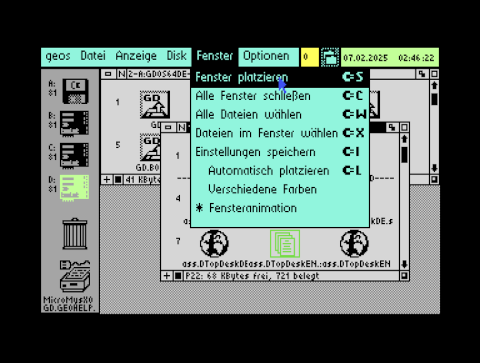

# Area6510

### DTOPDESK64
This is DTopDesk64, a rebuild of the reconstructed and updated source code from TopDesk64 V5.0de R.01 (2021/12/28).

DTopDesk64 includes also some fixes and improvements:

* Error corrections
* Minor corrections to the menu navigation
* Display of drive mode next to drive icons
* Number of colors used in the program interface reduced
* Minor improvements, e.g. optimized file/info function
* Additional keyboard shortcuts for various functions
* The window number (1-4) is also displayed in the window title
* If no DiskImage is currently mounted on an SD2IEC, the DiskImage selection box opens
* A Verify option is available for 1541/1571 drives

