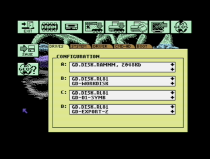

# Area6510

### GDOS64
This directory includes development releases of the GEOS update "GDOS64". These can be unstable and cause data loss. Use at your own risk!

The D81 images found here contain a setup file for GDOS64 german/english.
For installation it is recommended to copy the file to a RAM drive and start from there, because the analysis of the setup data on physical drives can take a long time.

#### ABOUT
GDOS64 is based on GeoDOS64-V3 and was planned as an update for GEOS MegaPatch that was started in 1999 but was never finished.
A lot of things have changed but applications developed for GEOS MegaPatch should work on GDOS64 also.

System requirements:

* C64 (C128 not supported)
* 512Kb RAM (C=REU, GeoRAM, SuperCPU, RAMLink)
* C1351 mouse

Recommended:

* 1024Kb RAM
* TurboCard (SuperCPU, TurboChameleon64)
* 1581/SD2IEC

#### NOTES
There is no special version for GEOS128. This is because it would be to much work for an hobby project.

This will be a project for the Commodore 64 only.

#### SCREENSHOTS

