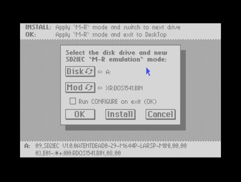

# Area6510

### GSD2IEC-MR
GSD2IEC-MR can be used to set the "M-R emulation" mode on SD2IEC (Required for GEOS 2.0 only)

GEOS/Configure detects a drive by certain bytes within the drive ROM. The SD2IEC cannot provide this information without further assistance from the user.
That's where the "M-R emulation" mode can help: The feedback is simulated using a real drive ROM. To do this, the appropriate ROM file must be stored on the SD2IEC. Recommended:

**Main directory**
-> DOS1541.BIN
-> DOS1571.BIN
-> DOS1581.BIN

The appropriate ROM image file must be activated with the SD2IEC command "XR". Only one ROM image can be active!

**OPEN15,8,15,"XR:DOS1541.BIN":CLOSE15**

The "GSD2IEC-MR" program sends this command to the selected drive, activating the "M-R" emulation mode. The drive can then be configured using the CONFIGURE program, enable option "Run CONFIGURE" to start CONFIGURE on exit.

GSD2IEC-MR does not alter the active disk image on the SD2IEC!

**NOTE:** It is recommended to start GSD2IEC-MR and CONFIGURE from a disk drive other then the drive you want to configure!

#### USAGE
In the following, CONFIGURE stands for the English "CONFIGURE" or the German "KONFIGURIEREN". It does not matter whether the 'CONFIGURE' is for the C=REU or for a GeoRAM.

The ‘uIEC_Man64’ application is a separate program for changing disk images on the SD2IEC and, like the ‘CONFIGURE’ program, is not part of GSD2IEC-MR.

For the 'uIEC_Man64' program, the disk images must be stored in special directories within the root directory:
// GEOSD64 -> D64 files
// GEOSD71 -> D71 files
// GEOSD81 -> D81 files

You will also need the kernal ROMs for 1541/1571/1581 (also in the root directory):
// DOS1541.BIN -> for D64 files
// DOS1571.BIN -> for D71 files
// DOS1581.BIN -> for D81 files

Copy the 'CONFIGURE', 'uIEC_Man64' and 'GSD2IEC-MR' files to a GEOS RAM disk. Run the 'GSD2IEC-MR' program.
Select the drive using [Drv] and the new mode for the SD2IEC using [Mod]. Then select 'Run CONFIGURE' and click 'OK'.

After starting 'CONFIGURE', set the drive A: to C: previously configured with the 'GSD2IEC-MR' program to 'No Drive' (do not switch off the drive!), then activate the new drive mode (1541, 1571 or 1581). Exit the program using the 'File|Exit' menu.

When you return to the DeskTop, the error LED on the drive may flash: this is normal as an incompatible disk image is active. To change this, start the 'uIEC_Man64' program, select drive A: to C:, select a suitable disk image from the list and open it with [OPEN]. Return to the DeskTop with 'GEOS|quit'.

The configured drive can now be opened from the DeskTop.
